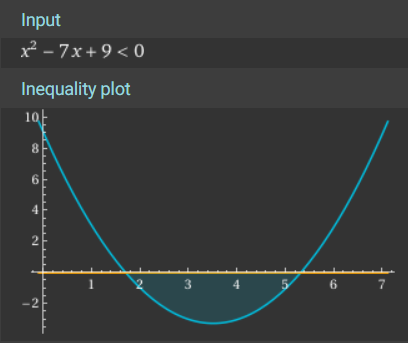

## Part 1

I have to admit, [my initial solution](https://github.com/WinslowJosiah/adventofcode/blob/3e7da8bc196cf422101f7512c41ef3516c735846/aoc/2023/day06/__init__.py)
for this puzzle was a bit on the [complicated](https://pep20.org/#complex) side.
I was trying too hard to think of a clever solution. Maybe it'll come to me if
I... _wait for it_.[^bad-joke]

[^bad-joke]: Bad joke, I know.

For now, let's do the simplest thing I can think of. Let's just count the number
of different button-holding times that beat the record distance.

If the time spent holding the button is $b$, and the total race time is $t$,
then the distance the boat will move is $b \times (t - b)$ -- the boat's
accumulated speed, times the amount of time remaining for the rest of the race.
Let's write a function that will `sum` up the cases for which the formula's
result is greater than the record distance.

```py title="2023\day06\solution.py"
def num_race_wins(time: int, distance: int) -> int:
    return sum(b * (time - b) > distance for b in range(time))
```

:::note
This works because [`bool` is a subclass of `int`](https://docs.python.org/3/library/stdtypes.html#boolean-type-bool);
if you do number-like things to `False` and `True`, they get treated like the
integers `0` and `1` respectively. So for example, `sum(n > 42 for n in values)`
will count the number of values in `values` that are greater than 42.
:::

Armed with this function, we can solve Part 1 very easily. `zip` runs through
the times and distances in parallel (keeping the time and record distance of
each race together), and we just need to pass them to our function and wrap it
in `math.prod`!

```py title="2023\day06\solution.py"
from math import prod

class Solution(StrSplitSolution):
    def part_1(self) -> int:
        times, distances = [
            list(map(int, line.split()[1:]))
            for line in self.input
        ]
        return prod(
            num_race_wins(time, distance)
            for time, distance in zip(times, distances)
        )
```

## Part 2

_Can_ I stick with brute-forcing this time? Yes; I just need to [`str.join`](https://docs.python.org/3/library/stdtypes.html#str.join)
the input numbers to get single time/distance numbers.

```py title="2023\day06\solution.py" ins={7-11}
...

class Solution(StrSplitSolution):
    ...

    def part_2(self) -> int:
        time, distance = [
            int("".join(line.split()[1:]))
            for line in self.input
        ]
        return num_race_wins(time, distance)
```

Is it _quick_ enough? Also yes; both parts run in ~2.34 seconds on my machine.

_Will_ I stick with brute-forcing? _No_; I feel like I was onto something with
my initial solution. And if I implement my idea well, it should spit out an
answer immediately, and I won't have to..._wait for it_.[^bad-joke-2]

[^bad-joke-2]: It's even worse the second time!

:::warning[Here be algebra]
If all you wanted was _an_ answer, you can stop here. If you want to see the
_faster_ answer I came up with, continue reading... but be wary if you weren't
that good at high school algebra.
:::

---

If we take our formula from before ($b \times (t - b) > d$) and rewrite it so
we're comparing with 0, we get $0 > b^2 - tb + d$. It looks like a quadratic
equation, but not quite: it's a quadratic _inequality_.

I noticed this when I wrote my initial solution, but directly calculating the
number of integer solutions to this inequality is harder than it sounds. (Or at
least, I couldn't figure it out day-of.)

:::image-figure[This plot corresponds to a 7ms race with a 9mm record distance.]

:::

Looking at a plot of this quadratic inequality, we can see that we'll find
integer solutions if $b$ is greater than the left root and less than the right
root.[^roots-are-not-solutions] All we have to do is find those roots.

[^roots-are-not-solutions]: The roots themselves are not solutions, because by
definition the Y-values there are 0. And 0 is _not_ less than 0.

If we apply [Po-Shen Loh's quadratic method](https://www.poshenloh.com/quadraticdetail)
here,[^quadratic-formula] the halfway point $h$ between the roots will be
$\frac{t}{2}$, and the left/right offset $o$ will be $\sqrt{h^2 - d}$. We will
calculate the lower bound of the solution as $L = \lfloor h - o \rfloor$, and
the upper bound of the solution as $U = \lceil h + o \rceil$ (using [`math.floor`](https://docs.python.org/3/library/math.html#math.floor)
and [`math.ceil`](https://docs.python.org/3/library/math.html#math.ceil) to
guarantee that they're outside of the range). Finally, $U - L - 1$ will be the
number of integers in this range.

[^quadratic-formula]: I could've used the more ~well-known~ commonly memorized
[quadratic formula](https://youtu.be/IvXgFLV2gOk), but I find Po-Shen Loh's
method much more [simple](https://pep20.org/#simple) to implement and [easy](https://pep20.org/#easy)
to explain.

This allows us to implement the `num_race_wins` function like so:

```py title="2023\day06\solution.py" ins="ceil, floor, " ins=", sqrt" ins={4-13}
from math import ceil, floor, prod, sqrt

def num_race_wins(time: int, distance: int) -> int:
    # NOTE The distance the boat travels is b * (t - b), where b is the
    # time spent holding the button, and t is the total race time; we
    # want the amount of b values where this distance is greater than
    # the record. To do this, I use some carefully handled algebra.
    halfway = time / 2
    offset = sqrt(halfway * halfway - distance)
    lower_root = floor(halfway - offset)
    upper_root = ceil(halfway + offset)
    # NOTE This is the length of the range, excluding the two endpoints.
    return upper_root - lower_root - 1
```

A bit more algebra, but a _much_ lower time complexity. Now both parts of my
solution run in ~3 microseconds on my machine -- almost six orders of magnitude
faster than before!
