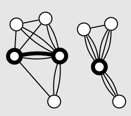

## Part 1

It's our last puzzle for 2023! What we're being asked this time is to find a
["minimum cut"](https://en.wikipedia.org/wiki/Minimum_cut) of our graph of
interconnected components, which will break it up into two groups; we will then
multiply the sizes of those groups to get our answer.

The first thing for us to do is build the graph itself. This time, let's
represent the graph as a `defaultdict(list)`; the name of a component will be a
key, and the list of components it's connected to will be its value.

```py title="2023\day25\solution.py"
from collections import defaultdict
from typing import Hashable

type Node = Hashable
type Graph[N: Node] = dict[N, list[N]]

...

class Solution(StrSplitSolution):
    def part_1(self) -> int:
        graph: Graph[str] = defaultdict(list)
        for line in self.input:
            root, nodes = line.split(": ")
            for node in nodes.split():
                graph[root].append(node)
                graph[node].append(root)
        ...
```

The minimum-cut algorithm I'll be using is [Karger's algorithm](https://en.wikipedia.org/wiki/Karger%27s_algorithm),
as it's the first robust approach that I understood.[^other-approaches] The main
thing to understand about it is its use of **edge contraction** -- an operation
that removes an edge from the graph, and merges its endpoints into a single
node (eliminating any resulting edges that connect that node to itself).

[^other-approaches]: [My initial solution](https://github.com/WinslowJosiah/adventofcode/blob/3e7da8bc196cf422101f7512c41ef3516c735846/aoc/2023/day25/__init__.py)
used an external library called [NetworkX](https://networkx.org) to calculate
the minimum cut of the graph.

    But when I started thinking of ways to avoid external libraries, my first
    thought was to find the shortest paths between random pairs of nodes. The
    idea is that getting from one group to the other requires us to move along
    one of the 3 minimum-cut edges, so if we do this enough times, those edges
    should be the most visited edges. I tested this approach out, and while that
    was usually true, it was untrue often enough that I didn't feel comfortable
    using it.

:::image-figure[The marked edge is contracted into a single node. :br :small[_(Image from the [WikiMedia Commons](https://commons.wikimedia.org/wiki/File:Edge_contraction_in_a_multigraph.svg), licensed under [CC BY-SA 3.0](https://creativecommons.org/licenses/by-sa/3.0/deed.en))._]]

:::

If you choose an edge in the graph at random, it's probably not going to be part
of the minimum cut. So the idea of Karger's algorithm is to keep randomly
choosing edges and contracting them; eventually, only two nodes will be left in
the graph, and the edges that connect them will (probably) be part of the
minimum cut.

:::image-figure[Karger's algorithm successfully finds the minimum cut of this graph. :br :small[_(Image from the [WikiMedia Commons](https://commons.wikimedia.org/wiki/File:Single_run_of_Karger%E2%80%99s_Mincut_algorithm.svg), modified, and licensed under [CC BY-SA 3.0](https://creativecommons.org/licenses/by-sa/3.0/deed.en))._]]

:::

This contraction process is random, so there is a chance that one or more edges
from the minimum cut will be contracted, which would lead to a wrong result. But
this can be mitigated by simply repeating the algorithm many times, and then
returning the result with the fewest edges; the probability that _every_
contraction results in a wrong minimum cut will become vanishingly small.

The recommended number of times to run this contraction process on a graph with
$n$ nodes is $\binom{n}{2} \ln n$ times, so the probability of not finding the
minimum cut is at most $\frac{1}{n}$. Instead of this, however, we'll just run
this contraction process until we get a cut with 3 edges -- because that's how
many wires the prompt says we have to disconnect.

So first, let's implement the contraction process. We can use [`copy.deepcopy`](https://docs.python.org/3/library/copy.html#copy.deepcopy)
to make a copy our graph (since we will be modifying it). Then we can use the
builtin [`random` module](https://docs.python.org/3/library/random.html) to let
us randomly choose an edge[^random-edge-bias] so we can contract it. Once we
have only two nodes left in our graph, we can return the number of edges
connected to one of the remaining nodes -- that will be the number of edges in
the cut we found.

[^random-edge-bias]: What we're doing is choosing a random node, then choosing
a random edge connected to that node. This actually biases our selection,
because an edge between two nodes of low degree (i.e. with few edges connected
to them) will be chosen more often than an edge between two nodes of high degree
(i.e. with many edges connected to them).

    It would be ideal to choose edges with equal probability, but I don't know
    of a succinct way to do that without keeping track of every single edge in a
    separate list. However, this edge selection approach is good enough for this
    puzzle.

```py title="2023\day25\solution.py" {"1":16} {"2":17-19} {"3":21} {"4":23}
from copy import deepcopy
import random

def karger_minimum_cut[N: Node](graph: Graph[N]) -> int:
    adjacency = deepcopy(graph)

    # Until there are two groups of contracted nodes
    while len(adjacency) > 2:
        # Choose random edge, with endpoints u and v
        # HACK This doesn't select edges with equal probability as would
        # be ideal, but it's short, and it works well enough.
        u, u_neighbors = random.choice(list(adjacency.items()))
        v = random.choice(u_neighbors)

        # Contract v into u
        adjacency[u].extend(adjacency[v])
        for node in adjacency[v]:
            adjacency[node].remove(v)
            adjacency[node].append(u)
        # Remove self-loops from u
        adjacency[u] = [node for node in adjacency[u] if node != u]
        # Remove v
        del adjacency[v]

    return len(next(iter(adjacency.values())))
```

Let's quickly go over what happens when the edge between nodes `u` and `v` is
contracted.

1. `u` becomes connected to whatever nodes `v` is connected to.
2. Every node that `v` is connected to stops connecting back to `v`, and starts
connecting to `u` instead.
3. `u` might now have some "self-loops", or edges connecting it to itself; these
are removed.
4. Finally, `v` is removed from the graph.

Now, we don't just want to return the number of edges in the cut we find; we
want to return the sizes of the groups once we actually make the cut. Luckily,
we can keep track of the group sizes as we go with minimal changes; each node
will be in its own "group" of size 1, and whenever an edge is contracted, the
resulting node's group size will be the sum of both nodes' group sizes.

```py title="2023\day25\solution.py" ins="tuple[" ins=", list[int]]" ins=", list(group_sizes.values())" ins={6,21,26}
from copy import deepcopy
import random

def karger_minimum_cut[N: Node](graph: Graph[N]) -> tuple[int, list[int]]:
    adjacency = deepcopy(graph)
    group_sizes = {node: 1 for node in graph}

    # Until there are two groups of contracted nodes
    while len(adjacency) > 2:
        # Choose random edge, with endpoints u and v
        # HACK This doesn't select edges with equal probability as would
        # be ideal, but it's short, and it works well enough.
        u, u_neighbors = random.choice(list(adjacency.items()))
        v = random.choice(u_neighbors)

        # Contract v into u
        adjacency[u].extend(adjacency[v])
        for node in adjacency[v]:
            adjacency[node].remove(v)
            adjacency[node].append(u)
        group_sizes[u] += group_sizes[v]
        # Remove self-loops from u
        adjacency[u] = [node for node in adjacency[u] if node != u]
        # Remove v
        del adjacency[v]
        del group_sizes[v]

    return len(next(iter(adjacency.values()))), list(group_sizes.values())
```

Lastly, we can call this function we made until it gives us a cut with 3 edges
(that's our minimum cut!), and use `math.prod` to get the product of the group
sizes.

```py title="2023\day25\solution.py"
from math import prod
...

class Solution(StrSplitSolution):
    def part_1(self) -> int:
        ...
        while True:
            num_edges, group_sizes = karger_minimum_cut(graph)
            if num_edges <= 3:
                return prod(group_sizes)
```

Because we're using a randomized algorithm, it might take us many tries until we
get an answer. While testing it out and running it repeatedly, I've seen it take
anywhere from 1 to 139 tries... but it only took about 18 tries on average. That
makes the average runtime about a second on my machine, so that's okay with me.

## Part 2

That's the end of Advent of Code 2023! At the time, it was the first Advent of
Code I ever participated in, and I found it extremely fun -- even if some days
were more challenging than others.

As I write this, it's nearing the end of 2025, and December is quickly
approaching. Looks like I'll have to save my 2024 solution explanations for next
year...

Happy holidays!
