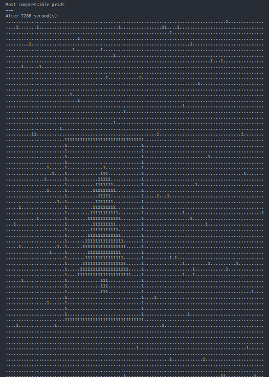

## Part 1

Before we start, let's get something unusual out of the way: we have some
important values that change between the sample input and the full puzzle input.
This will happen for some Advent of Code puzzles, and the way I address it in my
solution framework is to include a `self.testing` attribute, which is true if
we're using the test data and false otherwise.

```py title="2024\day14\solution.py"
class Solution(StrSplitSolution):
    def part_1(self) -> int:
        width, height = (11, 7) if self.testing else (101, 103)
        ...
```

Now for the interesting part: the robots. I think it's a good idea to make a
simple `Robot` class today, so let's create a [`dataclass`](https://docs.python.org/3/library/dataclasses.html#dataclasses.dataclass)
to store a robot's properties -- its X/Y position and its X/Y velocity.

```py title="2024\day14\solution.py"
from dataclasses import dataclass

@dataclass
class Robot:
    px: int
    py: int
    vx: int
    vy: int
    ...
```

This `Robot` class is going to have two methods:

1. An instance method that makes the robot step forward. We can make it take the
width and height as parameters, and the `%` operator can be used to make the
robot wrap around when it goes past the edges of the grid.
2. A class method for initializing a robot from a line of input. We can make the
parsing easy by extracting all the numbers using the `re` module,[^minus-sign]
converting them to `int`s using the `map` function, and passing them to the
class constructor using the `*` unpacking syntax.

[^minus-sign]: This time, the regular expression we use -- `-?\d+` -- will also
optionally match a minus sign before the number, because the X/Y velocities can
be negative. (This hasn't been the case in the other puzzles so far this year,
so leaving this out may throw you off.)

```py title="2024\day14\solution.py" ins={2-3,12-15,17-19}
from dataclasses import dataclass
import re
from typing import Self

@dataclass
class Robot:
    px: int
    py: int
    vx: int
    vy: int

    def step(self, width: int, height: int):
        """Move robot forward by one second."""
        self.px = (self.px + self.vx) % width
        self.py = (self.py + self.vy) % height

    @classmethod
    def from_line(cls, line: str) -> Self:
        return cls(*map(int, re.findall(r"-?\d+", line)))
```

It'll be useful to visualize what's going on with the robots, so let's write a
quick function to help with that. `collections.Counter` will help us count the
robots at each tile, and we can basically loop over all the grid's X/Y locations
and join their tiles together into a big string.

```py title="2024\day14\solution.py"
from collections import Counter

def robots_to_grid_str(robots: list[Robot], width: int, height: int) -> str:
    grid = Counter((robot.px, robot.py) for robot in robots)
    return "\n".join(
        "".join(str(grid.get((x, y), ".")) for x in range(width))
        for y in range(height)
    )
```

Let's also create a debug function to test this visualization function out
(using the `p=2,4 v=2,-3` test line from the prompt). On each iteration of the
`for` loop, we will first print out the state of the grid, then we will make
each robot step forward.

```py title="2024\day14\solution.py" "_debug_grid"
...

class Solution(StrSplitSolution):
    ...
    def _debug_grid(self) -> None:
        width, height = 11, 7
        robots = [Robot.from_line("p=2,4 v=2,-3")]

        print("Initial state:")
        print(robots_to_grid_str(robots, width, height))
        print()

        second = 0
        for _ in range(5):
            for robot in robots:
                robot.step(width, height)
            second += 1

            print(f"After {second} second(s):")
            print(robots_to_grid_str(robots, width, height))
            print()
```

Here's the output we get for this test case. It matches what the prompt says we
should get, so this gives us confidence that we're doing the visualization
right.

```text
Initial state:
...........
...........
...........
...........
..1........
...........
...........

After 1 second(s):
...........
....1......
...........
...........
...........
...........
...........

After 2 second(s):
...........
...........
...........
...........
...........
......1....
...........

After 3 second(s):
...........
...........
........1..
...........
...........
...........
...........

After 4 second(s):
...........
...........
...........
...........
...........
...........
..........1

After 5 second(s):
...........
...........
...........
.1.........
...........
...........
...........
```

Now that we know how the robot update loop is going to work, adapting it for the
actual puzzle will be easy; we simply have to make the robots step forward 100
times.

```py title="2024\day14\solution.py" ins={6-11}
...

class Solution(StrSplitSolution):
    def part_1(self) -> int:
        width, height = (11, 7) if self.testing else (101, 103)
        robots = [Robot.from_line(line) for line in self.input]

        for _ in range(100):
            for robot in robots:
                robot.step(width, height)

        print(robots_to_grid_str(robots, width, height))
        ...
```

And once again, we can print the result at the end to verify that it's correct.
This is the resulting grid of robots for the prompt's sample input after 100
simulated seconds, which exactly matches what we expect!

```text
......2..1.
...........
1..........
.11........
.....1.....
...12......
.1....1....
```

Only one thing is left for us to figure out: the calculation of the safety
factor. We'll want to count the robots in each quadrant, which we can actually
do with `Counter` as well; we just have to figure out how to transform a robot's
X/Y position to one of four different unique values, one for each quadrant, and
then we can simply use a `Counter` to count them.

The way I found to do this is with a `tuple` of `bool`s, which are true if the
X/Y position is greater than the middle X/Y value and false otherwise. This
gives us four possible unique values for the quadrants like we want:

1. `(False, False)` = the upper left quadrant.
2. `(False, True)` = the lower left quadrant.
3. `(True, False)` = the upper right quadrant.
4. `(True, True)` = the lower right quadrant.

We'll only want to count the robots that aren't exactly in the middle X or Y
positions, and then we'll want to return the product of the quadrant robot
counts using `math.prod`.

```py title="2024\day14\solution.py" ins={2}
from collections import Counter
from math import prod

def safety_factor(robots: list[Robot], width: int, height: int) -> int:
    mid_x, mid_y = width // 2, height // 2

    quadrants = Counter(
        (robot.px > mid_x, robot.py > mid_y)
        for robot in robots
        if robot.px != mid_x and robot.py != mid_y
    )
    return prod(quadrants.values())
```

The safety factor after 100 simulated seconds will then be our answer.

```py title="2024\day14\solution.py" ins={12}
...

class Solution(StrSplitSolution):
    def part_1(self) -> int:
        width, height = (11, 7) if self.testing else (101, 103)
        robots = [Robot.from_line(line) for line in self.input]

        for _ in range(100):
            for robot in robots:
                robot.step(width, height)

        return safety_factor(robots, width, height)
```

We were thankfully able to keep our Part 1 code relatively simple... which, in
my estimation, means that Part 2 is either going to be simple as well (even if a
clever insight may be needed) or _way_ more complicated. Only one way to find
out...

## Part 2

I'll be honest: I didn't like this puzzle in 2024, and I still don't like it
now. What does the prompt even _mean_ by "a picture of a Christmas tree"? I
don't like having to [guess](https://pep20.org/#ambiguity) at such an ambiguous
requirement.

Originally, I solved this part by looking at [the Reddit solution thread](https://reddit.com/comments/1hdvhvu)
and implementing the first purely programmatic approach I saw that worked for
somebody; luckily, it just so happened to work for me. But as it turns out, that
approach didn't work for everyone... and neither did the _second_ approach I
saw. This reminded me of how I felt about [2023 Day 21](/solutions/2023/day/21)
-- that is to say, not very good.

I can assure you that, once you know what this "Christmas tree" picture looks
like, you'll _definitely_ know it when you see it, and maybe you could figure
out how to find that specific picture in code. But it's no fun to be told what
it looks like beforehand -- and in theory, you shouldn't _have_ to be told. So I
asked myself: if I didn't already know what I was looking for and how to find
it, how would I have figured it out? Here's what I landed on.

---

Whatever this "Christmas tree" looks like, it's probably going to look like some
sort of recognizable pattern, and not like random noise. If we decided to
[compress](https://en.wikipedia.org/wiki/Data_compression) the grid of robots,
the resulting size would probably be lowest once the Christmas tree shows up,
because data with patterns compresses better than completely random data. Python
has several builtin compression modules,[^optional-modules] which have been
consolidated into a package called [`compression`](https://docs.python.org/3/library/compression.html)
since version 3.14; let's use the `compression.zlib` module and see what
happens.

[^optional-modules]: These modules are all "optional modules", which aren't
required to be included in a Python distribution -- in this case, because the
necessary third-party compression libraries aren't available for some platforms.

    These modules are all available in my version of CPython for Windows, so
    I'll be using them in this writeup. But even if they're not available for
    you, the same principle would apply if you instead used a custom function
    for doing [run-length encoding](https://en.wikipedia.org/wiki/Run-length_encoding).
    (In fact, try making such a function anyway as an exercise! I found a neat
    way to do it using [`itertools.groupby`](https://docs.python.org/3/library/itertools.html#itertools.groupby).)

Before that, however, let's quickly do the job of unifying both our solution
functions for today. We'll want to loop through every possible grid state --
because of the simple way the robots move, all robots go back to their original
positions after `width * height` seconds[^at-least-100] -- and exit early if we
find the solutions to both parts. (We'll write the part that _finds_ the Part 2
solution later.)

[^at-least-100]: Of course, because we only get the answer to Part 1 after 100
simulated seconds, we'll want to make sure that we're simulating at least 100
seconds. This is the purpose of that `max` call.

```py title="2024\day14\solution.py" ins={8,10,12-16,20-21,25-26,28} {18} ins=/(solve)\\(/ ins="tuple[int, int]" ins=/for (second) in range\\((.+)\\):/
...

class Solution(StrSplitSolution):
    def solve(self) -> tuple[int, int]:
        width, height = (11, 7) if self.testing else (101, 103)
        robots = [Robot.from_line(line) for line in self.input]

        part_1, part_2 = None, None
        for second in range(max(width * height, 100) + 1):
            grid_str = robots_to_grid_str(robots, width, height)

            if second == 100:
                print("Robots after 100 seconds:")
                print(grid_str)
                print()
                part_1 = safety_factor(robots, width, height)

            # TODO Add solve-Part-2 code

            if part_1 is not None and part_2 is not None:
                break

            for robot in robots:
                robot.step(width, height)
        else:
            assert part_1 is not None, "failed to simulate 100 seconds"

        return part_1, part_2
```

:::attention
Pay attention to the update order in the `for second in` loop!

1. _First_, the robots are converted to a grid string, and then analyzed for the
information we want.
2. _Then_, the robots all step forward.

This ensures that the recorded grid/safety factor and the value of `second`
match; for example, `second` is 0 at the point before any robots have moved. I
didn't keep this in mind at first, and so my first submitted answer was
[off by one](https://en.wikipedia.org/wiki/Off-by-one_error).
:::

Now to test out the `compression` package. I'll be saving the grid strings at
each second, and at the end I'll want to find and report the "most compressible"
grids -- the grids with the smallest size after being compressed. Each of the
modules in the `compression` package has a `compress` function for performing
that compression method on a `bytes` object -- which we can create from our
string by calling its [`str.encode`](https://docs.python.org/3/library/stdtypes.html#str.encode)
method before passing it.

```py
>>> from compression.zlib import compress
>>> data = """Around the world, around the world
... Around the world, around the world
... Around the world, around the world
... Around the world, around the world
... Around the world, around the world
... Around the world, around the world
... Around the world, around the world
... Around the world, around the world"""
>>> len(data)
279
>>> compressed = compress(data.encode())
b'x\x9cs,\xca/\xcdKQ(\xc9HU(\xcf/\xcaI\xd1QHD\x13\xe1r\x1c\x81J\x00\x14\x88d\xc7'
>>> len(compressed)
33
```

To efficiently get the `n` smallest items according to some metric, we can use
the [`heapq.nsmallest`](https://docs.python.org/3/library/heapq.html#heapq.nsmallest)
function with an argument for the sorting `key`; in this case, the key will be
the length of the grid string after using `compress` on it. So I'll save the
grid string at each simulated second in a `dict`, and I'll get the 5 smallest
`items` -- pairs of each second value and grid string[^second-value-is-first] --
by that metric and print them.

[^second-value-is-first]: Amusingly, the "second value" is _first_. (In other
words, the number of elapsed seconds is the first item of the pair.)

```py title="2024\day14\solution.py" ins={1-2,9,12,17-22,24-29}
from compression.zlib import compress
from heapq import nsmallest
...

class Solution(StrSplitSolution):
    def solve(self) -> tuple[int, int]:
        ...
        part_1, part_2 = None, None
        grids: dict[int, str] = {}
        for second in range(max(width * height, 100) + 1):
            grid_str = robots_to_grid_str(robots, width, height)
            grids[second] = grid_str
            ...
        else:
            assert part_1 is not None, "failed to simulate 100 seconds"

        most_compressible_grids = nsmallest(
            5,
            grids.items(),
            key=lambda kv: len(compress(kv[1].encode())),
        )
        part_2 = most_compressible_grids[0][0]  # TODO Verify solution

        print("Most compressible grids")
        print("---")
        for second, grid_str in most_compressible_grids:
            print(f"After {second} second(s):")
            print(grid_str)
            print()

        return part_1, part_2
```

With any luck, we'll see the Christmas tree image within these highly
compressible grids, so we know exactly what we're looking for. In my case, the
most compressible grid occurred after **7,286** simulated seconds, and it in
fact had the Christmas tree image!

::::details
:summary[The Christmas tree image (click to show)]
:::image-figure[Yup, I _definitely_ knew it when I saw it.]

:::
::::

Perfect. Now we know what the Christmas tree _looks_ like, and we even have code
to find it. But the repeated compression on every single grid string makes this
code pretty slow: it takes ~16.5 seconds to run on my machine. We know exactly
what we're looking for now, so we _should_ be able to improve the runtime with a
different approach to searching for it (as well as exiting early once we _know_
we've found it).

The easiest distinctive feature I can think of to search for is the solid
rectangular border around the tree; this is a feature of no other grids, and we
can probably detect it very simply. I counted that the border is 31 tiles wide
and 33 tiles high; using this knowledge, we can search for `"1" * 31` (i.e. 31
copies of the string `"1"`) in the string, and if we find it, that's almost
certainly going to be the horizontal segment of the border around the tree.

```py title="2024\day14\solution.py" del={1-2,11,14} ins={22-28,37}
from compression.zlib import compress
from heapq import nsmallest
...

class Solution(StrSplitSolution):
    def solve(self) -> tuple[int, int]:
        width, height = (11, 7) if self.testing else (101, 103)
        robots = [Robot.from_line(line) for line in self.input]

        part_1, part_2 = None, None
        grids: dict[int, str] = {}
        for second in range(max(width * height, 100) + 1):
            grid_str = robots_to_grid_str(robots, width, height)
            grids[second] = grid_str

            if second == 100:
                print("Robots after 100 seconds:")
                print(grid_str)
                print()
                part_1 = safety_factor(robots, width, height)

            # HACK Because we know the Christmas tree has a solid border
            # around it, we can simply check whether this border exists.
            if "1" * 31 in grid_str:
                print(f"Christmas tree found after {second} seconds:")
                print(grid_str)
                print()
                part_2 = second

            if part_1 is not None and part_2 is not None:
                break

            for robot in robots:
                robot.step(width, height)
        else:
            assert part_1 is not None, "failed to simulate 100 seconds"
            assert part_2 is not None, "Christmas tree Easter egg not found"

        return part_1, part_2
```

This brings the runtime down to ~7.7 seconds on my machine. That might be as
good of a general solution as I can get.
